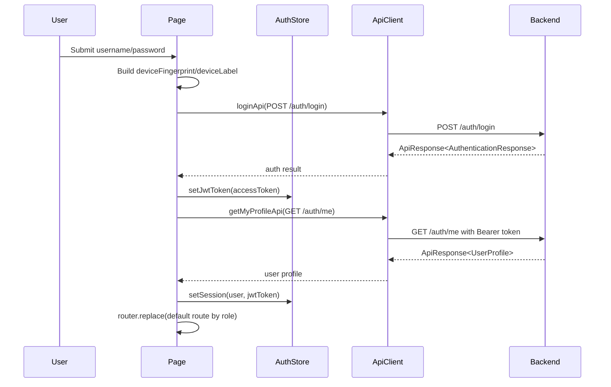

# 02 - Auth Flow

## Current Behavior

- Login page: `src/app/auth/login/page.tsx`.
- Form fields: `username`, `password`; UI label says `Email`, input type is `email`.
- Staff login sends device fingerprint: PARTIAL. All login calls send `deviceFingerprint` and `deviceLabel`, but field/UI is email-oriented and staff internal username UX is not supported.
- Token storage: access token in Zustand memory `jwtToken` only, `src/stores/use-auth-store.ts`. Device fingerprint/label use `localStorage` in `src/lib/auth/device-fingerprint.ts`. Refresh token is expected in HttpOnly cookie via backend because Axios uses `withCredentials: true`.
- Current user source: `GET /auth/me` after login in `src/app/auth/login/page.tsx`; profile type in `src/service/user/type.ts`.
- Role redirect: DONE after login via `getDefaultRouteByRoles()` in `src/app/auth/login/page.tsx`.
- Route guard: MISSING. `src/app/(protected)/layout.tsx` only renders sidebar/main.
- Middleware: MISSING. No `middleware.ts` found.
- Logout flow: API functions exist in `src/service/user/api.ts`, but no UI/logout button calls them.
- Refresh token: PARTIAL. Axios response interceptor calls `/auth/refresh` on 401 in `src/lib/api/axios-config.ts`; no app bootstrap refresh on reload.
- Login error handling: toast in `onError` of login mutation; no field-level backend errors.
- Unknown device display: MISSING. 403 is normalized as `ApiError` in `src/lib/api/axios-config.ts`; no blocking screen or request-permission action.
- User/PWA lazy auth: MISSING. `/driver` is placeholder only.

## Login Sequence

## Auth Concern Table

| Auth Concern           | Current Frontend Status | Files                                                               | Backend Contract Needed                                                   | Risk                                                              | Suggested Fix Phase |
| ---------------------- | ----------------------- | ------------------------------------------------------------------- | ------------------------------------------------------------------------- | ----------------------------------------------------------------- | ------------------- |
| SYSTEM_ADMIN login     | PARTIAL                 | `src/app/auth/login/page.tsx`, `src/service/user/api.ts`            | Confirm `/auth/login`, `/auth/me`, role `SYSTEM_ADMIN`                    | No route guard means admin UI can render as Guest/mock.           | PHASE_0_FOUNDATION  |
| PARKING_MANAGER login  | PARTIAL                 | `src/app/auth/login/page.tsx`                                       | Confirm role `PARKING_MANAGER` and manager username/email rules           | Form label/type assumes email.                                    | PHASE_0_FOUNDATION  |
| STAFF login            | PARTIAL                 | `src/app/auth/login/page.tsx`, `src/lib/auth/device-fingerprint.ts` | Staff username format, trusted-device error code, device request endpoint | Operational staff spec says internal username, but UI says Email. | PHASE_0_FOUNDATION  |
| USER/PWA lazy auth     | MISSING                 | `src/app/(protected)/driver/page.tsx`                               | Phone+plate OTP, session QR token contract                                | PWA cannot support visitor workflow.                              | PHASE_4_PWA         |
| token storage          | PARTIAL                 | `src/stores/use-auth-store.ts`, `src/lib/api/axios-config.ts`       | Refresh cookie behavior, access token lifetime                            | Reload loses user/access token until bootstrap exists.            | PHASE_0_FOUNDATION  |
| role redirect          | DONE                    | `src/app/auth/login/page.tsx`                                       | Role enum exact names                                                     | Redirect only runs after login, not direct navigation.            | PHASE_0_FOUNDATION  |
| route guard            | MISSING                 | `src/app/(protected)/layout.tsx`                                    | Required role per route                                                   | Staff/User can open admin/manager routes client-side.             | PHASE_0_FOUNDATION  |
| logout                 | PARTIAL                 | `src/service/user/api.ts`                                           | Confirm `/auth/logout` response                                           | No logout UI/action; session clear not connected.                 | PHASE_0_FOUNDATION  |
| refresh token          | PARTIAL                 | `src/lib/api/axios-config.ts`, `src/service/user/api.ts`            | HttpOnly cookie, CORS credentials                                         | 401 retry exists; initial reload restore missing.                 | PHASE_0_FOUNDATION  |
| device fingerprint     | PARTIAL                 | `src/lib/auth/device-fingerprint.ts`, `src/app/auth/login/page.tsx` | Fingerprint semantics, uniqueness and trust boundary                      | Fingerprint is simple local UUID/demo seeds, not secure identity. | PHASE_0_FOUNDATION  |
| unknown device request | MISSING                 | `src/lib/api/axios-config.ts`                                       | Error code and request-permission endpoint                                | Staff cannot request approval when device blocked.                | PHASE_1_CRUD_BASIC  |
| kill switch handling   | MISSING                 | MISSING                                                             | Staff inactive/kill switch error codes and manager APIs                   | Inactive staff may see generic login/API error only.              | PHASE_1_CRUD_BASIC  |

## Specific Findings

- `AuthenticationResponse` includes `refreshToken` in `src/service/user/type.ts`, but code does not store it. Existing docs say refresh token should be HttpOnly cookie; keep that direction.
- `src/components/layout/sidebar.tsx` falls back to `MOCKED_SYSTEM_ADMIN_ROLES` if user is null. That is MOCK_ONLY and risky for route/nav accuracy.
- `src/lib/api/axios-config.ts` clears auth on refresh failure but does not redirect to `/auth/login`.
